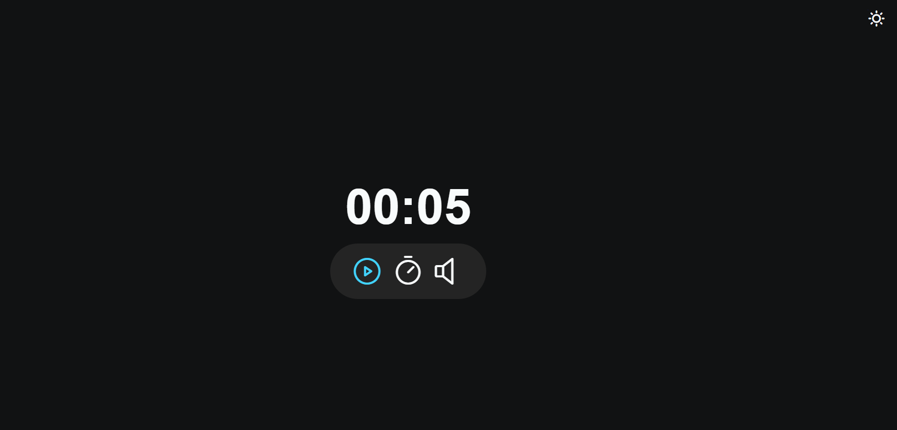

# Focus Timer v2 - versao 2 

"Focus Timer", um projeto de timer que utiliza ES6 modules, estados, variáveis, callback functions e um modo escuro / claro.

> Stage 05 - Avançando no JavaScript 

Além disso, abordamos as callback functions, que nos permitiram executar ações específicas quando certos eventos ocorrerem, como o término do tempo ou a mudança do modo escuro para o claro.

Por fim, implementamos uma funcionalidade de dark / light mode, onde o usuário poderá alternar entre os modos escuro e claro para melhorar a experiência visual do timer.

👉🏼[Link do projeto](https://pomodoro-version-2.netlify.app/)

## 🔗 Tecnologias Usadas

## 🔗 Deploy 

## 🔗 Meu Contato

## 🚀 Sobre mim
 Estudante de Engenharia de Software na UNOPAR e 
 Desenvolvedor Full Stack estudando na Rocketseat dentro do Programa Explorer 
